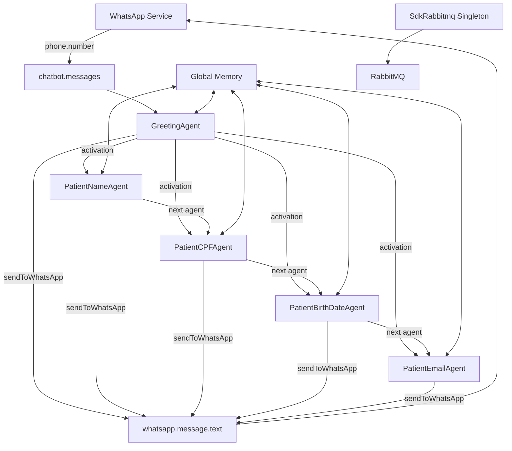
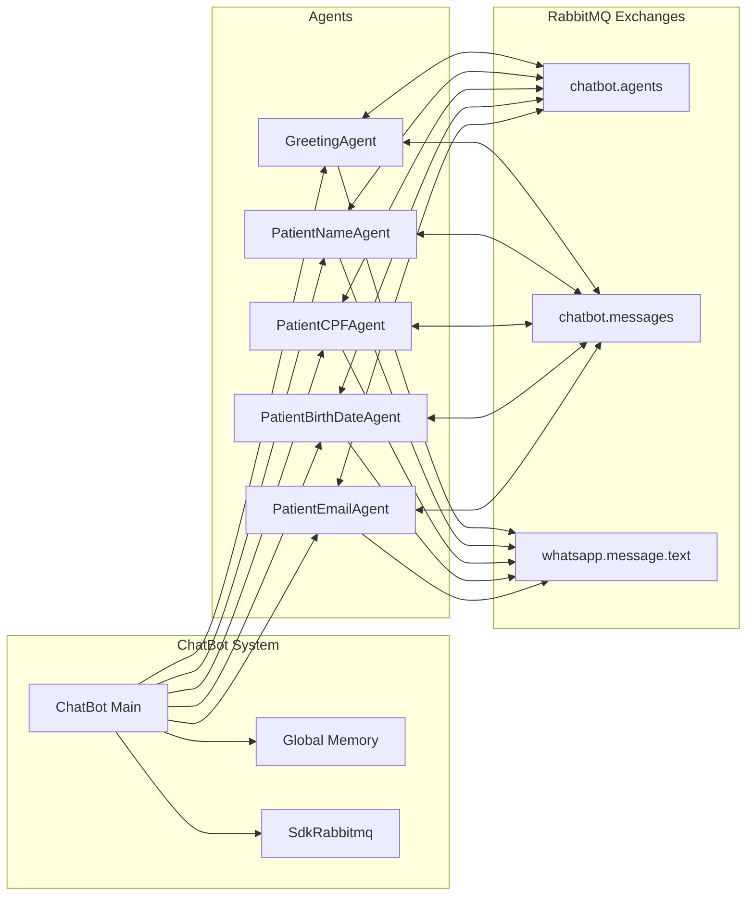
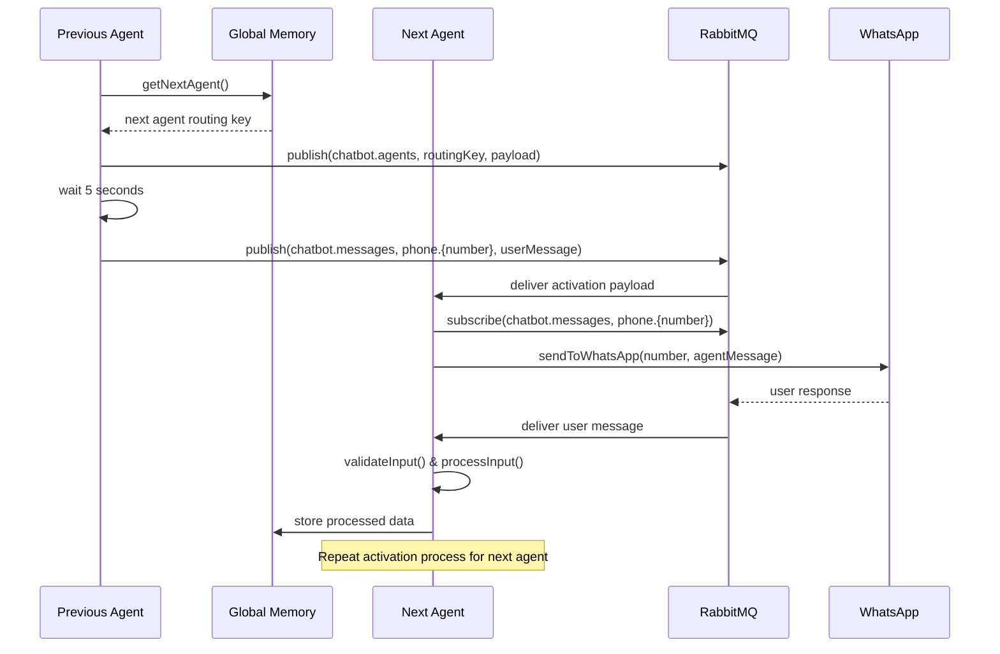
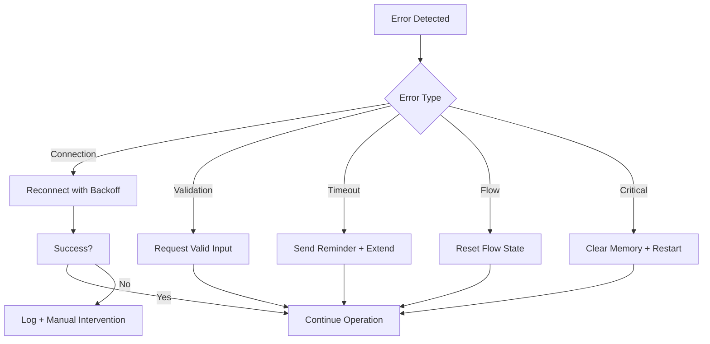

# Design Document - WhatsApp Multi-Agent Chatbot

## Overview

O sistema é um chatbot WhatsApp multi-agent que utiliza dynamic self-routing através do RabbitMQ para coletar informações de pacientes de forma sequencial e automatizada. Cada agente é responsável por coletar um tipo específico de informação e dinamicamente ativa o próximo agente na sequência através de uma memória global compartilhada.

### Key Design Principles

- **Dynamic Self-Routing**: Agentes escolhem autonomamente o próximo agente a ser ativado
- **Singleton Pattern**: SdkRabbitmq utiliza singleton para gerenciar conexões
- **Event-Driven Architecture**: Comunicação baseada em eventos via RabbitMQ
- **Stateful Memory**: Memória global compartilhada para gerenciar fluxo e dados
- **Concurrent Processing**: Suporte a múltiplas sessões simultâneas

## Architecture

### High-Level Architecture



### Component Architecture



## Agent Activation Flow

### Standard Agent Activation Process

Todos os agentes (exceto GreetingAgent) seguem o mesmo padrão de ativação:



### Key Activation Steps

1. **Receive Activation**: Agent recebe payload com número do telefone
2. **Subscribe to Phone**: Agent se inscreve em `phone.{number}` para receber mensagens do usuário
3. **Send Agent Message**: Agent envia sua mensagem específica para o WhatsApp do usuário
4. **Wait for Response**: Agent aguarda resposta do usuário
5. **Process & Validate**: Agent processa e valida a entrada do usuário
6. **Store Data**: Agent armazena dados processados na memória global
7. **Activate Next**: Agent busca próximo agente na memória global (`getNextAgent()`) e publica payload de ativação

### Dynamic Routing Logic

O roteamento dinâmico funciona através da memória global:

```typescript
// Exemplo de como getNextAgent() funciona
getNextAgent(): string | null {
  if (this.agentsFlow.length > 0) {
    // Remove e retorna o primeiro item da lista (FIFO)
    return this.agentsFlow.shift() || null;
  }
  return null; // Fluxo completo
}
```

**Fluxo inicial**: `['patient.name', 'patient.cpf', 'patient.birthDate', 'patient.email']`

- GreetingAgent ativa → `getNextAgent()` retorna `'patient.name'` → Lista fica: `['patient.cpf', 'patient.birthDate', 'patient.email']`
- PatientNameAgent ativa → `getNextAgent()` retorna `'patient.cpf'` → Lista fica: `['patient.birthDate', 'patient.email']`
- PatientCPFAgent ativa → `getNextAgent()` retorna `'patient.birthDate'` → Lista fica: `['patient.email']`
- PatientBirthDateAgent ativa → `getNextAgent()` retorna `'patient.email'` → Lista fica: `[]`
- PatientEmailAgent ativa → `getNextAgent()` retorna `null` → Fluxo completo

## Components and Interfaces

### 1. SdkRabbitmq Singleton

**Purpose**: Gerenciar conexões RabbitMQ e operações de mensageria

**Interface**:
```typescript
interface ISdkRabbitmq {
  static getInstance(): Promise<SdkRabbitmq>;
  publish(exchange: string, routingKey: string, message: object): Promise<void>;
  subscribe(exchange: string, queueName: string, routingKey: string, callback: Function): Promise<void>;
  bind(exchange: string, queueName: string, routingKey: string): Promise<void>;
  unbind(exchange: string, queueName: string, routingKey: string): Promise<void>;
  purgeQueue(queueName: string): Promise<void>;
  close(): Promise<void>;
}
```

**Key Methods**:
- `getInstance()`: Retorna instância singleton
- `publish()`: Publica mensagens em exchanges
- `subscribe()`: Inscreve em filas com callback
- `bind()/unbind()`: Gerencia bindings de filas
- `purgeQueue()`: Limpa mensagens de filas

### 2. Global Memory Manager

**Purpose**: Gerenciar estado global do chatbot e fluxo de agentes

**Interface**:
```typescript
interface IGlobalMemory {
  agentsFlow: string[];
  clientesVisitantes: Set<string>;
  clientData: Map<string, ClientData>;
  clientStages: Map<string, ClientStage>;
  lastMessageSent: Map<string, number>; // number -> timestamp
  
  // Pega o primeiro agente da fila e remove da lista (FIFO)
  getNextAgent(): string | null;
  
  // Métodos para gerenciar clientes
  addClient(number: string): void;
  hasClient(number: string): boolean;
  
  // Métodos para gerenciar dados dos clientes
  setClientData(number: string, field: string, value: any): void;
  getClientData(number: string): ClientData;
  
  // Métodos para gerenciar estágios dos clientes
  getCurrentStage(number: string): string | null;
  setCurrentStage(number: string, stage: string): void;
  markStageAsVisited(number: string, stage: string): void;
  markStageAsError(number: string, stage: string): void;
  getStageErrorCount(number: string, stage: string): number;
  
  // Controle de mensagens duplicadas
  canSendMessage(number: string): boolean;
  markMessageSent(number: string): void;
  
  // Limpa toda a memória global
  clear(): void;
  
  // Reinicia o fluxo de agentes para um cliente específico
  resetAgentsFlow(): void;
}

interface ClientStage {
  number: string;
  currentStage: string;
  visitedStages: Set<string>;
  stageErrors: Map<string, number>; // stage -> error count
  lastActivity: Date;
}

interface ClientData {
  number: string;
  name?: string;
  cpf?: string;
  email?: string;
  birthDate?: string;
  currentAgent?: string;
  startTime: Date;
  lastActivity: Date;
}
```

### 3. Base Agent Class

**Purpose**: Classe base para todos os agentes com funcionalidades comuns

**Interface**:
```typescript
abstract class BaseAgent {
  protected routingKey: string;
  protected agentName: string;
  protected sdkRabbitmq: SdkRabbitmq;
  protected globalMemory: IGlobalMemory;
  
  abstract getAgentMessage(): string;
  abstract validateInput(input: string): boolean;
  abstract processInput(number: string, input: string): void;
  
  // Método para enviar mensagem do agente para WhatsApp do usuário
  protected async sendToWhatsApp(number: string, message: string): Promise<void> {
    // CRITICAL: Check if we can send message (prevent duplicate messages)
    if (!this.globalMemory.canSendMessage(number)) {
      throw new Error(`BLOCKED: Cannot send duplicate message to ${number}. Last message sent too recently.`);
    }
    
    // Send message to WhatsApp
    await this.sdkRabbitmq.publish('whatsapp.message.text', 'send', {
      number: number,
      text: message
    });
    
    // Mark message as sent with timestamp
    this.globalMemory.markMessageSent(number);
    
    console.log(`Message sent to ${number}: ${message}`);
  }
  
  // Método para ativar próximo agente no fluxo
  protected async activateNextAgent(number: string): Promise<void> {
    // 1. Get next agent routing key from global memory
    const nextAgentRoutingKey = this.globalMemory.getNextAgent();
    
    if (nextAgentRoutingKey) {
      // 2. Create activation payload
      const payload: AgentActivationPayload = {
        number: number,
        sender: this.agentName,
        timestamp: Date.now()
      };
      
      // 3. Publish to next agent queue
      await this.sdkRabbitmq.publish('chatbot.agents', nextAgentRoutingKey, payload);
      
      // 4. Wait 5 seconds
      await new Promise(resolve => setTimeout(resolve, 5000));
    }
  }
  
  // Método para se inscrever nas mensagens de um telefone específico
  protected async subscribeToPhone(number: string): Promise<void> {
    const queueName = `queue-${this.agentName}-${number}`;
    const routingKey = `phone.${number}`;
    
    await this.sdkRabbitmq.subscribe(
      'chatbot.messages', 
      queueName, 
      routingKey, 
      (message: UserMessage) => this.handleUserMessage(message)
    );
  }
  
  protected async unsubscribeFromPhone(number: string): Promise<void> {
    const queueName = `queue-${this.agentName}-${number}`;
    const routingKey = `phone.${number}`;
    
    await this.sdkRabbitmq.unbind('chatbot.messages', queueName, routingKey);
  }
  
  // Método para processar mensagens do usuário
  private async handleUserMessage(message: UserMessage): Promise<void> {
    // 1. Validate user input
    if (!this.validateInput(message.text)) {
      await this.sendToWhatsApp(message.number, "Por favor, forneça uma informação válida.");
      return;
    }
    
    // 2. Process and store data
    this.processInput(message.number, message.text);
    
    // 3. Unsubscribe from this phone (agent job done)
    await this.unsubscribeFromPhone(message.number);
    
    // 4. Activate next agent
    await this.activateNextAgent(message.number);
    
    // 5. Wait 5 seconds and forward original message
    await new Promise(resolve => setTimeout(resolve, 5000));
    await this.sdkRabbitmq.publish('chatbot.messages', `phone.${message.number}`, message);
  }
  
  // Método principal executado quando agente é ativado
  public async onActivation(payload: AgentActivationPayload): Promise<void> {
    // 1. Verify if this agent should be active for this stage
    const currentStage = this.globalMemory.getCurrentStage(payload.number);
    if (currentStage !== this.routingKey) {
      console.log(`Agent ${this.agentName} received activation but current stage is ${currentStage}, ignoring.`);
      return;
    }
    
    // 2. Check if we can send message (prevent duplicate messages)
    if (!this.globalMemory.canSendMessage(payload.number)) {
      console.log(`Cannot send message to ${payload.number}, too recent message sent.`);
      return;
    }
    
    // 3. Subscribe to phone messages
    await this.subscribeToPhone(payload.number);
    
    // 4. Send agent message to WhatsApp user
    await this.sendToWhatsApp(payload.number, this.getAgentMessage());
    
    // 5. Mark message as sent to prevent duplicates
    this.globalMemory.markMessageSent(payload.number);
    
    // 6. Wait for user response and process
    // (handled by message subscription callback)
  }
  
  // Método para processar mensagens recebidas do WhatsApp
  public async onWhatsAppMessage(number: string, message: string): Promise<void> {
    // 1. Verify if this agent should handle this message
    const currentStage = this.globalMemory.getCurrentStage(number);
    if (currentStage !== this.routingKey) {
      console.log(`Agent ${this.agentName} received message but current stage is ${currentStage}, ignoring.`);
      return;
    }
    
    // 2. Validate user input
    if (!this.validateInput(message)) {
      // Increment error count
      this.globalMemory.markStageAsError(number, this.routingKey);
      
      const errorCount = this.globalMemory.getStageErrorCount(number, this.routingKey);
      
      if (errorCount >= 3) {
        // Set default value after 3 errors
        const defaultValue = this.getDefaultValueForErrors();
        this.processInput(number, defaultValue);
        
        await this.sendToWhatsApp(number, `Após 3 tentativas, definindo valor padrão. Continuando...`);
      } else {
        await this.sendToWhatsApp(number, `Informação inválida (tentativa ${errorCount}/3). ${this.getAgentMessage()}`);
        return;
      }
    } else {
      // 3. Process and store valid data
      this.processInput(number, message);
    }
    
    // 4. Mark stage as visited
    this.globalMemory.markStageAsVisited(number, this.routingKey);
    
    // 5. Unsubscribe from this phone (agent job done)
    await this.unsubscribeFromPhone(number);
    
    // 6. Activate next agent
    await this.activateNextAgent(number);
  }
  
  // Método abstrato para valor padrão em caso de erros
  abstract getDefaultValueForErrors(): string;
}
```

### 4. Specific Agent Implementations

#### GreetingAgent
- **Routing Key**: N/A (listens to all phones)
- **Responsibility**: Primeira interação e roteamento inicial
- **Special Behavior**: Sempre ativo, gerencia novos vs existentes clientes

#### PatientNameAgent
- **Routing Key**: `patient.name`
- **Message**: "Por favor, informe seu nome completo:"
- **Validation**: Caracteres válidos para nome (mínimo 2 palavras)
- **Default Value**: "Nome Não Informado"
- **WhatsApp Message Reception**: Recebe via `chatbot.messages` + `phone.{number}`
- **Behavior**: Verifica estágio atual antes de enviar mensagem

#### PatientCPFAgent
- **Routing Key**: `patient.cpf`
- **Message**: "Agora preciso do seu CPF (apenas números):"
- **Validation**: Formato e checksum de CPF válido
- **Default Value**: "00000000000"
- **WhatsApp Message Reception**: Recebe via `chatbot.messages` + `phone.{number}`
- **Behavior**: Verifica estágio atual antes de enviar mensagem

#### PatientBirthDateAgent
- **Routing Key**: `patient.birthDate`
- **Message**: "Qual sua data de nascimento? (formato: DD/MM/AAAA)"
- **Validation**: Formato de data válido e idade entre 0-120 anos
- **Default Value**: "01/01/1970"
- **WhatsApp Message Reception**: Recebe via `chatbot.messages` + `phone.{number}`
- **Behavior**: Verifica estágio atual antes de enviar mensagem

#### PatientEmailAgent
- **Routing Key**: `patient.email`
- **Message**: "Por último, informe seu e-mail:"
- **Validation**: Formato de email válido via regex
- **Default Value**: "nao-informado@sistema.com"
- **WhatsApp Message Reception**: Recebe via `chatbot.messages` + `phone.{number}`
- **Behavior**: Verifica estágio atual antes de enviar mensagem

## Message Flow Control

### WhatsApp Message Reception

Todos os agentes (exceto GreetingAgent) recebem mensagens do WhatsApp através do padrão:

```typescript
// WhatsApp Service sempre envia mensagens para:
// Exchange: 'chatbot.messages'
// Routing Key: 'phone.{number}'

// Exemplo de fluxo:
// 1. Usuário envia mensagem no WhatsApp
// 2. WhatsApp Service publica: sdkRabbitmq.publish('chatbot.messages', 'phone.5511999999999', userMessage)
// 3. Agent ativo (subscrito em 'phone.5511999999999') recebe a mensagem
// 4. Agent processa via onWhatsAppMessage(number, message)
```

### Duplicate Message Prevention

**CRÍTICO**: O sistema DEVE prevenir envio de mensagens duplicadas:

```typescript
interface MessageControl {
  canSendMessage(number: string): boolean {
    const lastSent = this.lastMessageSent.get(number);
    if (!lastSent) return true;
    
    const timeDiff = Date.now() - lastSent;
    const MIN_INTERVAL = 2000; // 2 segundos mínimo entre mensagens
    
    return timeDiff >= MIN_INTERVAL;
  }
  
  markMessageSent(number: string): void {
    this.lastMessageSent.set(number, Date.now());
  }
}
```

### Stage Management

Cada cliente tem um estágio atual que determina qual agente deve processar suas mensagens:

```typescript
// Exemplo de controle de estágio:
// Cliente inicia: currentStage = 'patient.name'
// PatientNameAgent processa → currentStage = 'patient.cpf'
// PatientCPFAgent processa → currentStage = 'patient.birthDate'
// etc.

interface StageControl {
  // Verifica se agente deve processar mensagem
  shouldProcessMessage(agentRoutingKey: string, number: string): boolean {
    const currentStage = this.getCurrentStage(number);
    return currentStage === agentRoutingKey;
  }
}
```

## Data Models

### Message Payload Structure

```typescript
interface AgentActivationPayload {
  number: string;
  sender: string;
  timestamp: number;
}

interface WhatsAppMessage {
  number: string;
  text: string;
  timestamp?: number;
}

interface UserMessage {
  number: string;
  text: string;
  timestamp: Date;
  correlationId?: string;
}
```

### Global Memory Data Structure

```typescript
interface GlobalMemoryState {
  agentsFlow: string[];
  clientesVisitantes: Set<string>;
  clientData: Map<string, ClientData>;
  sessionTimeouts: Map<string, NodeJS.Timeout>;
}
```

## Error Handling

### 1. Connection Failures
- **RabbitMQ Connection Loss**: Automatic reconnection with exponential backoff
- **WhatsApp Service Unavailable**: Queue messages for retry
- **Agent Crash**: Graceful recovery and session restoration

### 2. Validation Errors
- **Invalid User Input**: Request valid input with specific error message
- **Timeout Scenarios**: Send reminder and extend timeout once
- **Data Corruption**: Log error and restart user session

### 3. Flow Management Errors
- **Empty Agents Flow**: Log error and restart flow
- **Unknown Agent**: Log error and skip to next agent
- **Memory Corruption**: Clear and reinitialize global memory

### Error Recovery Strategy



## Testing Strategy

### 1. Unit Tests
- **SdkRabbitmq**: Connection, publish, subscribe operations
- **Global Memory**: State management and data integrity
- **Individual Agents**: Message processing and validation
- **Base Agent**: Common functionality and error handling

### 2. Integration Tests
- **Agent Flow**: Complete patient data collection flow
- **Concurrent Sessions**: Multiple users simultaneously
- **Error Recovery**: System behavior under failure conditions
- **RabbitMQ Integration**: Exchange and queue operations

### 3. End-to-End Tests
- **WhatsApp Integration**: Full message flow from WhatsApp to agents
- **Session Management**: Complete user journey from start to finish
- **System Restart**: Recovery after system shutdown/restart
- **Load Testing**: Performance under high message volume

### Test Data Management
- **Mock WhatsApp Service**: Simulate WhatsApp message sending/receiving
- **Test RabbitMQ Instance**: Isolated environment for testing
- **Synthetic User Data**: Generated test data for patient information
- **Session State Fixtures**: Predefined states for testing recovery

## Performance Considerations

### 1. Scalability
- **Horizontal Scaling**: Multiple ChatBot instances with shared RabbitMQ
- **Queue Partitioning**: Distribute load across multiple queues
- **Connection Pooling**: Efficient RabbitMQ connection management

### 2. Memory Management
- **Session Cleanup**: Automatic cleanup of expired sessions
- **Data Persistence**: Move completed sessions to persistent storage
- **Memory Monitoring**: Track and alert on memory usage

### 3. Message Processing
- **Batch Processing**: Process multiple messages efficiently
- **Priority Queues**: Prioritize time-sensitive messages
- **Dead Letter Queues**: Handle failed message processing

## Security Considerations

### 1. Data Protection
- **PII Encryption**: Encrypt sensitive patient data in memory and logs
- **Data Retention**: Automatic cleanup of old patient data
- **Access Control**: Restrict access to global memory and queues

### 2. Message Security
- **Message Validation**: Validate all incoming messages
- **Rate Limiting**: Prevent spam and abuse
- **Authentication**: Verify WhatsApp service authenticity

### 3. System Security
- **RabbitMQ Security**: Use authentication and SSL/TLS
- **Network Security**: Secure communication channels
- **Audit Logging**: Track all system operations for security monitoring